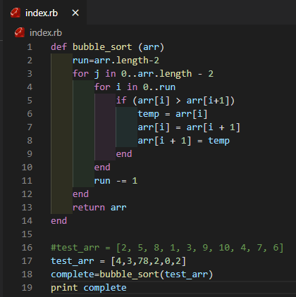
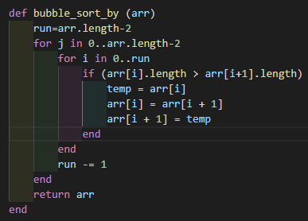

# Bubble Sort

> In this project we implement the bubble sort algorithm. Assignment is focused on the use of yield and passing a block to a method.

Additional description about the project and its features.

## Built With

- Ruby

## Authors

👤 **Victor Pacheco**

- GitHub: [@vichuge](https://github.com/vichuge)
- LinkedIn: [LinkedIn](https://www.linkedin.com/in/victor-pacheco-7946aab2/)

👤 **Alejandro Contreras**

- GitHub: [@githubhandle](https://github.com/AlejandroNo4)
- Twitter: [@Alejand80002666](https://twitter.com/alejand80002666)
- LinkedIn: [Alejandro Contreras](https://www.linkedin.com/in/alejandro-contreras-rodriguez-b524821b5/)

## 🤝 Contributing

Contributions, issues, and feature requests are welcome!

Feel free to check the [issues page](https://github.com/AlejandroNo4/Bubble-Sort-Ruby/issues).

## Show your support

Give a ⭐️ if you like this project!
